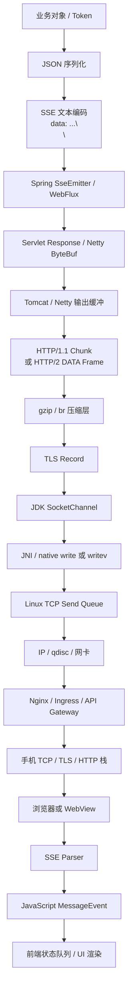

# SSE 跨层流式系统：从 Spring flush 到浏览器渲染

先记住两句话：

> SSE 不是一种新的传输协议，而是一个使用 `text/event-stream` 格式、长时间不结束的 HTTP 响应。服务器持续写入 UTF-8 文本，客户端按行解析，并在空行处派发完整事件。

> 整条链路不存在“端到端 flush”。每一层的 flush 只能把数据推向下一层，不能保证手机已经收到，更不能保证页面已经显示。

本文不局限于某个项目，而是把 SSE 当成一个跨越应用框架、Servlet 容器、HTTP、TLS、操作系统、代理和浏览器的完整流式系统来分析。

## 版本与阅读边界

文中的数值分为三类：

- **协议固定值**：例如 TLS 1.3 单条明文记录的长度上限、HTTP/2 默认流控窗口。
- **软件默认值**：例如 Tomcat、Netty、Nginx 某一版本的默认配置，升级后可能变化。
- **环境值**：例如 Linux `SO_SNDBUF`、网关超时和移动 WebView 行为，必须在生产环境现场确认。

本文核对时主要参考 Spring Framework 5.3.31 与 6.2.17、Tomcat 10.1.57、OpenJDK 21、当前 WHATWG/RFC 和 Nginx 官方文档。排查自己的系统时，应以实际依赖版本和生效配置为准。

## 一、先区分四种完全不同的“缓存”

日常交流里，人们经常把下面四件事都叫作“缓存”：

| 类型 | 含义 | 典型例子 |
|---|---|---|
| Cache | 保存完整结果，供后续请求复用 | HTTP Cache、CDN Cache |
| Buffer | 暂存当前响应的一部分 | Servlet response buffer、Nginx proxy buffer |
| Batch | 业务主动攒一批再发送 | 每 50ms 合并一次模型 token |
| Queue / Backpressure | 下游变慢后，待发送数据排队 | TCP Send-Q、Netty outbound buffer |

因此：

```http
Cache-Control: no-cache
```

主要控制 HTTP 缓存语义，不等于关闭以下机制：

- Servlet response buffer；
- gzip 或 brotli 压缩缓冲；
- Nginx `proxy_buffering`；
- TLS 输出缓冲；
- TCP send buffer；
- WebView 或 Fetch polyfill 的读取缓冲；
- 前端自己的批量状态更新。

如果不先区分 Cache、Buffer、Batch 和 Queue，后面的排查很容易变成“到处调 buffer 大小”。

## 二、一条事件实际经过哪些层



每一层都可能：

- 拆分数据；
- 合并数据；
- 暂存数据；
- 因下游速度慢而阻塞；
- 在上一层 flush 后重新建立新的缓冲边界。

所以，一次 SSE 事件不对应固定的：

- 一个 HTTP chunk；
- 一个 HTTP/2 DATA frame；
- 一个 TLS record；
- 一个 TCP packet；
- 一次 JavaScript 回调；
- 一次 UI 重绘。

反过来，一个 TCP 包里也可能包含多条 SSE 事件。

## 三、SSE 在线路上的真实格式

一条事件可以写成：

```text
id: 123\n
event: token\n
data: {"text":"你"}\n
\n
```

末尾的十六进制字节是：

```text
0a 0a
```

也就是两个 LF。最小消息可以是：

```text
data: hello\n\n
```

心跳可以使用注释行：

```text
:\n\n
```

### 空行和 flush 是两件事

假设服务器只写入：

```text
data: hello\n
```

即使这些字节已经到达客户端，`EventSource` 也不会触发 `message`，因为事件还没有通过空行结束。

反过来，服务器内存里已经形成：

```text
data: hello\n\n
```

但没有继续向下游写出，字节仍可能停在某一层缓冲区。

完整派发至少需要两个条件：

```text
事件格式完整，有空行结束
+
字节已经到达客户端 SSE 解析器
```

WHATWG 规范还规定：

- 事件流始终按 UTF-8 解码；
- CRLF、单独 LF、单独 CR 都可以结束一行；
- 多个 `data:` 行使用换行拼接；
- 没有数据的空事件不会派发；
- 流直接结束不能替代最后一个空行。

参考：[WHATWG Server-Sent Events](https://html.spec.whatwg.org/multipage/server-sent-events.html)。

## 四、浏览器如何解析任意字节片段

Chromium/Blink 中与 SSE 相关的核心类包括 `EventSource` 和 `EventSourceParser`。网络层交给解析器的字节片段可能是半行、一行或多行，解析器不能依赖 TCP 包边界。

下面是概念化伪代码。它特意处理了 CRLF，且空行只有在 `data` 缓冲不为空时才会派发事件：

```cpp
void addBytes(Span<char> bytes) {
    for (char ch : bytes) {
        if (previousWasCR) {
            previousWasCR = false;
            if (ch == '\n') {
                continue; // CRLF 只算一个行结束符
            }
        }

        if (ch == '\r') {
            processLine();
            previousWasCR = true;
        } else if (ch == '\n') {
            processLine();
        } else {
            currentLine.push_back(ch);
        }
    }
}

void processLine() {
    if (currentLine.empty()) {
        if (dataBuffer.empty()) {
            return;
        }

        dataBuffer.pop_back(); // 去掉最后一个 data 行附加的换行
        dispatchMessageEvent(eventType, dataBuffer, lastEventId);
        dataBuffer.clear();
        eventType.clear();
        return;
    }

    parseField(currentLine); // data、event、id、retry 或注释
    currentLine.clear();
}
```

Chromium 原生 `EventSource` 会采用不缓存资源结果的加载策略，但这只影响浏览器资源缓存，不会关闭：

- 操作系统 Socket buffer；
- TLS 解密缓冲；
- HTTP/2 流控；
- 反向代理缓冲；
- Android WebView 厂商实现；
- Fetch/XHR polyfill 自己的读取方式。

JavaScript 也不能设置浏览器的 `SO_RCVBUF`，更不能要求浏览器“每收到一个 TCP 包就立即回调”。

源码入口：

- [Chromium EventSource](https://github.com/chromium/chromium/blob/main/third_party/blink/renderer/modules/eventsource/event_source.cc)
- [Chromium EventSourceParser](https://github.com/chromium/chromium/blob/main/third_party/blink/renderer/modules/eventsource/event_source_parser.cc)

## 五、Spring MVC `SseEmitter` 到底做了什么

`SseEmitter` 本身不是 Socket，也不管理 TCP。它主要负责：

1. 管理异步 HTTP 响应生命周期；
2. 把 Java 对象转换为 SSE 文本；
3. 通过 `HttpMessageConverter` 写入 Servlet response；
4. 在发送后推动当前输出继续向下游 flush。

典型调用链可以概括为：

```text
SseEmitter.send(builder)
  -> builder.build()
  -> ResponseBodyEmitter.send(...)
  -> Handler.send(...)
  -> HttpMessageConverter.write(...)
  -> ServerHttpResponse.flush()
  -> HttpServletResponse.flushBuffer()
```

### Spring 5 与 Spring 6 的发送差异

Spring 5.3.31 中，一个 builder 生成的多个组成部分会逐项调用 `send`，每个 converter write 后都会 flush：

```java
synchronized (this) {
    for (DataWithMediaType item : items) {
        super.send(item.getData(), item.getMediaType());
    }
}
```

Spring 6.2.17 中，builder 生成的集合会在写锁内批量交给 handler，handler 写完一个逻辑事件的全部组成部分后统一 flush：

```java
writeLock.lock();
try {
    super.send(dataToSend);
} finally {
    writeLock.unlock();
}
```

两种实现都不能被理解成“Spring 要等缓冲区满了才发送”。

源码入口：

- [Spring 5.3.31 SseEmitter](https://github.com/spring-projects/spring-framework/blob/v5.3.31/spring-webmvc/src/main/java/org/springframework/web/servlet/mvc/method/annotation/SseEmitter.java)
- [Spring 5.3.31 ResponseBodyEmitterReturnValueHandler](https://github.com/spring-projects/spring-framework/blob/v5.3.31/spring-webmvc/src/main/java/org/springframework/web/servlet/mvc/method/annotation/ResponseBodyEmitterReturnValueHandler.java)
- [Spring 6.2.17 SseEmitter](https://github.com/spring-projects/spring-framework/blob/v6.2.17/spring-webmvc/src/main/java/org/springframework/web/servlet/mvc/method/annotation/SseEmitter.java)

### `earlySendAttempts` 不是持续发送队列

在 handler 尚未安装时，`ResponseBodyEmitter` 会暂存提前发生的发送。这只覆盖一个很短的初始化窗口：

```text
Controller 已经创建并返回 emitter
但 Spring 尚未完成异步 handler 初始化
```

handler 初始化完成后，这些事件会立即交给真实发送链路。它不是固定字节缓冲，也不是“攒够若干条再发”的业务队列。

### Spring MVC 没有 Reactive Streams 背压模型

正常情况下：

```java
emitter.send(event);
```

是一次同步发送调用。下游写不动时，可能表现为：

- `send()` 耗时增加；
- 发送线程阻塞；
- 抛出 `IOException`；
- 客户端断开后继续写入并触发异常。

Spring 官方说明还指出：`send()` 抛出 `IOException` 后，应用通常不需要再手工调用 `completeWithError`，Servlet 容器会触发异步错误通知并由 Spring 完成后续分派。

参考：[Spring MVC 异步请求](https://docs.spring.io/spring-framework/reference/6.2/web/webmvc/mvc-ann-async.html)。

## 六、Servlet Response Buffer 与 ResponseWrapper

Servlet API 提供：

```java
response.setBufferSize(size);
response.getBufferSize();
response.flushBuffer();
```

`setBufferSize` 表示希望容器使用至少指定大小的响应缓冲，必须在响应体开始写入前设置。

`flushBuffer()` 的语义是：

1. 提交状态码和响应头；
2. 排空当前 Servlet response buffer；
3. 把数据继续交给容器协议层。

它不保证字节已经到达客户端。

参考：[Jakarta Servlet 6.0 Specification](https://jakarta.ee/specifications/servlet/6.0/jakarta-servlet-spec-6.0)。

### 最危险的中间层：缓存响应体的 Wrapper

```java
class LoggingResponseWrapper extends HttpServletResponseWrapper {
    private final ByteArrayOutputStream cachedBody = new ByteArrayOutputStream();

    @Override
    public ServletOutputStream getOutputStream() {
        return streamBackedBy(cachedBody);
    }

    @Override
    public void flushBuffer() {
        // 如果这里不向真实 response 传播 flush，流式链路就断了。
    }

    void copyBodyToRealResponse() throws IOException {
        realResponse.getOutputStream().write(cachedBody.toByteArray());
    }
}
```

链路会变成：

```text
Spring 每次 send 后 flush
-> Wrapper 收到 flush
-> Wrapper 没有向 Tomcat 写出
-> 请求结束或达到 Wrapper 阈值后才整体复制
```

Spring 的 `ContentCachingResponseWrapper` 本身就是“先缓存、后复制”的设计，它的 `flushBuffer()` 不会立刻把缓存体写到底层，必须在合适时机调用 `copyBodyToResponse()`。

因此 SSE 路径通常应绕开：

- 响应日志 body wrapper；
- 审计响应 wrapper；
- ETag body wrapper；
- 脱敏 body wrapper；
- 统一响应签名 wrapper；
- 自定义 gzip wrapper。

参考：[ContentCachingResponseWrapper 源码](https://github.com/spring-projects/spring-framework/blob/v6.2.17/spring-web/src/main/java/org/springframework/web/util/ContentCachingResponseWrapper.java)。

## 七、Tomcat 的响应缓冲与 Socket 写入

典型链路：

```text
HttpServletResponse.flushBuffer()
-> Catalina OutputBuffer.doFlush(...)
-> Coyote Response.commit()
-> Http11OutputBuffer.flush()
-> Chunked / Gzip OutputFilter.flush()
-> SocketWrapperBase.flush()
-> NioSocketWrapper.doWrite()
-> SocketChannel.write()
```

常见缓冲区不能混为一谈：

| Buffer | 默认或典型值 | 性质 |
|---|---:|---|
| Servlet 字符/字节响应缓冲 | 8192 | 当前响应 body 的容器缓冲 |
| HTTP response header buffer | 8192 | 只存响应头，不存 SSE body |
| NIO application write buffer | 8192/连接 | Tomcat 到 SocketChannel 的写缓冲 |
| Socket send buffer | OS/JVM 决定 | 内核发送排队容量 |
| TLS 输出缓冲 | 实现相关，常见约 16KB 以上 | 加密输出暂存 |
| HTTP/2 stream window | 初始 65535 | 流控额度，不是普通缓存 |

Tomcat 10.1.57 及相近版本中，`socket.appWriteBufSize` 的默认值为 8192 字节。升级或使用不同连接器时应重新核对。

### 8KB 是容量，不是发送门槛

没有 flush 时：

```text
write 100 bytes
-> 可能继续停在 response buffer
```

调用 flush 时：

```text
buffer 中即使只有 100 bytes
-> 容器也应尝试继续向下游排空
```

因此，把 `socket.appWriteBufSize` 从 8192 改成 512 不是常规的 SSE 低延迟方案。它更直接影响每连接内存、复制次数、系统调用次数和高并发容量。

### Servlet Async 不等于所有 Socket 写入都不阻塞

`SseEmitter` 使用 Servlet Async，因此 Controller 请求线程可以释放；但 Spring MVC 的流式写入仍使用 Servlet blocking I/O，由 Spring 管理的线程执行。

底层非阻塞 Socket 暂时不可写时，容器仍需要保存未完成数据、等待可写事件并继续排空。异步请求生命周期和完全非阻塞的应用写入模型是两件事。

Tomcat 源码入口：

- [OutputBuffer](https://github.com/apache/tomcat/blob/10.1.57/java/org/apache/catalina/connector/OutputBuffer.java)
- [Http11OutputBuffer](https://github.com/apache/tomcat/blob/10.1.57/java/org/apache/coyote/http11/Http11OutputBuffer.java)
- [SocketWrapperBase](https://github.com/apache/tomcat/blob/10.1.57/java/org/apache/tomcat/util/net/SocketWrapperBase.java)
- [NioEndpoint](https://github.com/apache/tomcat/blob/10.1.57/java/org/apache/tomcat/util/net/NioEndpoint.java)

## 八、压缩为何经常破坏小片段流式输出

Tomcat 和 Spring Boot 默认通常不会对 SSE 自动启用压缩：

- Tomcat `compression` 默认关闭；
- Spring Boot `server.compression.enabled` 默认是 `false`；
- 常见默认 MIME 列表不包含 `text/event-stream`。

真正危险的通常是全局自定义 gzip filter、网关压缩或 CDN 压缩。

Java 压缩流有一个关键参数：

```java
new GZIPOutputStream(outputStream, syncFlush)
```

当 `syncFlush == false` 时，调用 `flush()` 不保证压缩器内部的少量 pending 数据已经形成可下发的压缩块。

当 `syncFlush == true` 时，会采用类似 `Z_SYNC_FLUSH` 的方式推出当前压缩数据，但会增加协议开销并降低压缩率。

```java
// 小片段可能继续留在 Deflater 内部。
new GZIPOutputStream(response.getOutputStream(), false);

// 支持同步 flush，但要承担额外开销。
new GZIPOutputStream(response.getOutputStream(), true);
```

对 SSE 更稳妥的基线是：

> 在 `text/event-stream` 路径关闭 gzip 和 brotli，再根据抓包结果决定是否需要流式压缩。

参考：[GZIPOutputStream Java 21 API](https://docs.oracle.com/en/java/javase/21/docs/api/java.base/java/util/zip/GZIPOutputStream.html)。

## 九、HTTP/1.1 Chunked、HTTP/2 DATA Frame 与 TLS

### HTTP/1.1 Chunked

SSE 通常不知道响应最终长度，因此不能预先设置 `Content-Length`。在 HTTP/1.1 中，容器一般使用：

```http
Transfer-Encoding: chunked
```

线路格式示意：

```text
1a\r\n
data: {"text":"hello"}\n\n\r\n
```

必须区分：

```text
SSE event boundary = 空行
HTTP chunk boundary = 长度字段 + CRLF
TCP packet boundary = TCP/IP 栈决定
```

代理可以接收上游 chunk、解码、缓冲、重新分块，再发送给下游。因此应用端的一次 flush 即便暂时形成一个 chunk，也不保证下游保留同样边界。

不要把 `chunked_transfer_encoding off` 当作 SSE 常规修复。未知长度的 HTTP/1.1 长响应本来就适合 chunked。

参考：[RFC 9112 HTTP/1.1](https://www.rfc-editor.org/rfc/rfc9112.html)。

### HTTP/2 DATA Frame 与流控

HTTP/2 不使用 `Transfer-Encoding: chunked`，响应体位于 DATA frame 中。

| 参数 | 协议默认值 | 含义 |
|---|---:|---|
| `SETTINGS_MAX_FRAME_SIZE` | 16384 字节 | 单个 frame payload 的最大值 |
| Stream 初始流控窗口 | 65535 字节 | 当前 stream 的可发送额度 |
| Connection 初始流控窗口 | 65535 字节 | 整条连接的可发送额度 |

这些数值都不是“攒到这么多才发送”。

流控窗口耗尽时：

```text
客户端消费或确认窗口更新变慢
-> 服务端不能继续发送 DATA
-> 输出队列增长
-> 上游最终感受到背压
```

真实部署还经常出现协议转换：

```text
应用 -> 网关：HTTP/1.1 chunked
网关 -> 手机：HTTP/2 DATA frame
```

网关会重新决定下游 frame 边界。

参考：[RFC 9113 HTTP/2](https://www.rfc-editor.org/rfc/rfc9113.html)。

### TLS Record

TLS 1.3 中，`TLSPlaintext` 的长度上限是 `2^14`，即 16384 字节。它是最大值，不是最小发送值。

100 字节 SSE 数据可以形成一个小 TLS record，也可能与后续数据合并，取决于：

- JSSE/OpenSSL 实现；
- 当前写入和 flush 策略；
- TLS 终止位置；
- Nginx `ssl_buffer_size`；
- 下游 Socket 是否可写。

同一请求还可能多次进入 TLS：

```text
手机
  <-> TLS
网关
  <-> TLS
Ingress / Sidecar
  <-> 明文或 TLS
应用
```

每次 TLS 终止都会重新分帧，上游 flush 边界不会原样传递到下一段连接。

参考：[RFC 8446 TLS 1.3](https://www.rfc-editor.org/rfc/rfc8446.html)。

## 十、WebFlux 与 Netty 是另一套发送模型

使用：

```java
Flux<ServerSentEvent<?>>
```

时，典型链路是：

```text
Flux
-> SSE Encoder
-> DataBuffer
-> Netty ByteBuf
-> ChannelOutboundBuffer
-> EventLoop
-> NIO / epoll writev
```

Reactor Netty 的 SSE 流可以按 Publisher 元素触发 flush，但仍然要继续经过 Netty、TLS、Socket、代理和浏览器。

Netty 常见默认写水位：

```text
low  = 32KB
high = 64KB
```

含义是：

```text
待发送队列超过 high
-> Channel.isWritable() 变为 false

待发送队列下降到 low 以下
-> Channel.isWritable() 恢复为 true
```

这是背压高低水位，不是“攒到 64KB 才 write”。

参考：

- [Reactor Netty HTTP Server](https://projectreactor.io/docs/netty/release/reference/http-server.html)
- [Netty WriteBufferWaterMark](https://github.com/netty/netty/blob/4.1/transport/src/main/java/io/netty/channel/WriteBufferWaterMark.java)

## 十一、JDK NIO、JNI 与 native write

Tomcat NIO 最终会进入：

```java
SocketChannel.write(ByteBuffer);
```

OpenJDK 11/21 的整体路径可以概括为：

```text
SocketChannelImpl.write()
-> IOUtil.write()
-> SocketDispatcher
-> JNI native method
-> POSIX write() / writev()
```

### HeapByteBuffer 为什么需要中转

OpenJDK 的 native dispatcher 需要稳定的 native address。直接缓冲区可以直接提供地址；普通堆缓冲区通常会先复制到临时 direct buffer，再执行系统调用。

```java
int write(FileDescriptor fd, ByteBuffer src) {
    if (src.isDirect()) {
        return nativeWrite(fd, src.address(), src.remaining());
    }

    ByteBuffer temporary = getTemporaryDirectBuffer(src.remaining());
    temporary.put(src);
    temporary.flip();
    return nativeWrite(fd, temporary.address(), temporary.remaining());
}
```

这个临时 direct buffer：

- 不是 SSE 缓冲；
- 不等待凑满；
- 只为 native I/O 提供可用地址；
- 可能被线程缓存以减少直接内存分配。

### `writev`

多个缓冲区可以通过：

```c
writev(fd, iovecs, count);
```

一次交给内核。例如 HTTP chunk header、SSE payload 和尾部 CRLF 可以分别位于不同 `iovec` 中。

但一次 `writev()` 不保证：

- 写完全部数据；
- 生成一个 TCP packet；
- 生成一个 TLS record；
- 对应一个 SSE event。

### OpenJDK 21 native 层

OpenJDK 21 Unix 实现的核心非常直接：

```c
JNIEXPORT jint JNICALL
Java_sun_nio_ch_SocketDispatcher_write0(
        JNIEnv *env, jclass clazz, jobject fdo,
        jlong address, jint len) {

    jint fd = fdval(env, fdo);
    void *buf = (void *)jlong_to_ptr(address);
    return convertReturnVal(env, write(fd, buf, len), JNI_FALSE);
}
```

JNI 层没有一个额外的“攒够 N 字节再发”的 SSE 缓冲。它也不理解 `data:`、HTTP chunk 或事件边界。

源码入口：

- [OpenJDK 11 SocketChannelImpl](https://github.com/openjdk/jdk11u/blob/master/src/java.base/share/classes/sun/nio/ch/SocketChannelImpl.java)
- [OpenJDK 21 SocketChannelImpl](https://github.com/openjdk/jdk21u/blob/master/src/java.base/share/classes/sun/nio/ch/SocketChannelImpl.java)
- [OpenJDK 21 IOUtil](https://github.com/openjdk/jdk21u/blob/master/src/java.base/share/classes/sun/nio/ch/IOUtil.java)
- [OpenJDK 21 SocketDispatcher.c](https://github.com/openjdk/jdk21u/blob/master/src/java.base/unix/native/libnio/ch/SocketDispatcher.c)

## 十二、Linux TCP 发送队列与背压

`write(fd, buffer, length)` 进入 Linux 后，大致经过：

```text
write / writev syscall
-> sock_write_iter()
-> sock_sendmsg()
-> inet_sendmsg()
-> tcp_sendmsg()
-> TCP write queue
-> tcp_push()
-> tcp_write_xmit()
-> IP layer
-> qdisc
-> NIC driver
```

### `write()` 成功不等于客户端收到

```text
write(fd, buf, 100) = 100
```

只表示 Linux 内核接受了 100 字节。它不表示：

- 数据已经离开网卡；
- 对端已经 ACK；
- 网关已经转发；
- 手机进程已经读取；
- 浏览器已经解析；
- JavaScript 已经回调；
- UI 已经渲染。

网络没有与文件系统 `fsync()` 完全等价的“确保远端应用已经收到并显示”。

### 非阻塞写入与 `EAGAIN`

非阻塞 Socket 暂时写不进去时，系统调用可能返回 `EAGAIN/EWOULDBLOCK`。JDK 会把它转换成内部的“当前不可用”状态，NIO API 可能表现为本次写入 0 字节；Tomcat 或 Netty 保存剩余数据，注册可写事件后继续处理。

常见原因包括：

- Socket send buffer 接近上限；
- 对端接收窗口很小或为零；
- 严重丢包；
- 拥塞窗口不足；
- 下游网络很慢；
- HTTP/2 流控窗口耗尽。

Linux 源码入口：

- [net/socket.c](https://github.com/torvalds/linux/blob/master/net/socket.c)
- [net/ipv4/af_inet.c](https://github.com/torvalds/linux/blob/master/net/ipv4/af_inet.c)
- [net/ipv4/tcp.c](https://github.com/torvalds/linux/blob/master/net/ipv4/tcp.c)
- [net/ipv4/tcp_output.c](https://github.com/torvalds/linux/blob/master/net/ipv4/tcp_output.c)

## 十三、Socket Buffer、Nagle 与 autocork

`SO_SNDBUF` 是发送排队容量，不是“达到这个大小才发送”。生产环境应现场读取：

```bash
sysctl net.core.wmem_default
sysctl net.core.wmem_max
sysctl net.ipv4.tcp_wmem
ss -tinp
```

Linux 对显式 `SO_SNDBUF` 的处理还涉及上限和管理开销，`getsockopt()` 看到的值可能大于应用传入值。不要为了“及时发送”故意把发送缓冲调得很小，这通常只会更快触发背压、增加上下文切换并降低吞吐。

参考：

- [Linux IP sysctl](https://docs.kernel.org/networking/ip-sysctl.html)
- [socket(7)](https://man7.org/linux/man-pages/man7/socket.7.html)

### `TCP_NODELAY`

`TCP_NODELAY=true` 表示关闭经典 Nagle 算法。Tomcat 常见默认配置是开启 `tcpNoDelay`，但它仍不保证“一写一包”，也不保证手机立即收到。

### `TCP_CORK`

Linux 的 `TCP_CORK` 会倾向于暂缓不完整 segment，解除 cork 时推动当前数据。内核对 cork 有时间上限，它通常不能解释几十秒或几百条事件一起释放。

### `tcp_autocorking`

Linux 常见上游默认开启 `net.ipv4.tcp_autocorking`。它可能在很短时间尺度合并连续小写入，以减少包数，但不是固定的 4KB、8KB 或 200 条发送门槛。

参考：[tcp(7)](https://www.man7.org/linux/man-pages/man7/tcp.7.html)。

## 十四、Nginx 是最常见的真实缓冲点

Nginx 代理响应默认启用：

```nginx
proxy_buffering on;
```

开启后，Nginx 会尽快读取上游响应并放入自己的 buffer，响应很大时还可能写入临时文件。

| 配置 | 默认值 | 性质 |
|---|---:|---|
| `proxy_buffering` | `on` | 是否缓冲上游响应 |
| `proxy_buffer_size` | 一个内存页，通常 4KB/8KB | 读取响应头和首段 |
| `proxy_buffers` | `8 4k` 或 `8 8k` | 每个代理响应的缓冲池 |
| `proxy_busy_buffers_size` | 两个 buffer 左右 | 正在向下游发送的 busy buffer 上限 |
| `proxy_cache` | `off` | 完整响应缓存，与 buffering 不同 |
| `proxy_read_timeout` | 60s | 两次上游读取之间的空闲超时 |
| `send_timeout` | 60s | 两次下游写入之间的空闲超时 |
| `postpone_output` | 1460 | 小输出延后阈值 |
| `ssl_buffer_size` | 16k | TLS 输出缓冲 |

SSE location 的基础配置可以是：

```nginx
location /events {
    proxy_pass http://backend;

    proxy_http_version 1.1;
    proxy_set_header Connection "";

    proxy_buffering off;
    proxy_cache off;
    gzip off;

    proxy_read_timeout 1h;
    send_timeout 1h;

    # 只有抓包确认对应层仍有问题时再实验：
    # postpone_output 0;
    # ssl_buffer_size 4k;
}
```

应用也可以返回：

```http
X-Accel-Buffering: no
```

Nginx 官方文档明确说明该响应头可以控制代理缓冲，但基础设施可能通过 `proxy_ignore_headers` 忽略它。因此，最确定的做法仍是在 SSE location 显式设置 `proxy_buffering off`。

`postpone_output` 和 `ssl_buffer_size` 可能影响小写入，但优先级低于代理缓冲、压缩和响应 wrapper。不要一开始就调它们。

参考：

- [Nginx Proxy Module](https://nginx.org/en/docs/http/ngx_http_proxy_module.html)
- [Nginx Core Module](https://nginx.org/en/docs/http/ngx_http_core_module.html)
- [Nginx SSL Module](https://nginx.org/en/docs/http/ngx_http_ssl_module.html)

## 十五、客户端与 UI 仍可能再次批量显示

即使服务端、代理和网络都在持续传输，用户仍可能看到“突然吐出一批内容”。客户端侧需要继续区分：

- 原生 `EventSource` 是否收到完整空行事件；
- Fetch + `ReadableStream` 是否持续调用 `reader.read()`；
- `TextDecoder` 是否使用 `{ stream: true }`；
- 自定义 parser 是否正确保留半行和半个 UTF-8 字符；
- WebView 是否对 progressive response 有额外缓冲；
- 前端是否主动按 50ms、100ms 或 animation frame 合并状态更新；
- React/Vue 状态更新是否被批处理；
- Markdown 高亮、代码块解析或 DOM 更新是否阻塞主线程。

因此应分别记录：

```text
服务端生成时间
-> 应用 send 时间
-> 代理转发时间
-> 客户端收到字节时间
-> SSE 事件派发时间
-> 状态入队时间
-> UI 实际渲染时间
```

只看最终页面动画，无法判断数据究竟在哪一层聚合。

## 十六、配置总表

| 层 | 参数或缓冲 | 默认或典型值 | 类型 | 是否可能造成批量显示 |
|---|---|---:|---|---|
| 业务层 | token batch / stream interval | 无统一默认 | 主动批处理 | 是 |
| Spring MVC | `earlySendAttempts` | 动态集合 | 初始化暂存 | 仅初始化窗口 |
| Servlet/Tomcat | response buffer | 8192 | 容量 | 无 flush 时可能 |
| Tomcat | `socket.appWriteBufSize` | 8192 | 写缓冲容量 | 通常不是阈值 |
| Tomcat | `socket.txBufSize` | OS/JVM 默认 | 背压容量 | 满时阻塞 |
| 压缩 | gzip/br pending data | 实现相关 | 编码缓冲 | 是 |
| Netty | low/high watermark | 32KB/64KB | 背压水位 | 不是 flush 阈值 |
| HTTP/2 | max frame size | 16384 | 最大 frame | 不是最小发送值 |
| HTTP/2 | flow-control window | 65535 | 发送额度 | 耗尽后阻塞 |
| TLS 1.3 | plaintext record | 最大 16384 | 最大记录 | 不是最小发送值 |
| Linux | Socket send buffer | 环境相关 | 发送排队容量 | 满时背压 |
| Linux | `tcp_autocorking` | 常见为 1 | 短时合并优化 | 一般不造成长延迟 |
| Nginx | `proxy_buffering` | `on` | 响应缓冲 | 是，优先检查 |
| Nginx | `proxy_buffers` | `8 x 4K/8K` | 代理缓冲池 | 开启 buffering 时是 |
| Nginx | `postpone_output` | 1460 | 小输出延后 | 有可能，优先级低 |
| Nginx | `ssl_buffer_size` | 16K | TLS 输出缓冲 | 可能合并小写入 |
| Browser | 原生 EventSource | JS 不可配置 | 增量解析 | 空行后派发 |
| WebView/polyfill | 读取缓冲 | 实现相关 | 客户端缓冲 | 是 |
| 前端框架 | 状态更新 batch | 实现相关 | UI 批处理 | 是 |

## 十七、最有效的分层排查顺序

不要一开始抓内核源码，也不要先改十几个 buffer。按边界逐层缩小范围。

### 第一步：验证事件格式

确认真实字节包含完整空行：

```text
data: ...\n\n
```

检查是否错误地只写了一个换行，或 JSON 中的转义 `\\n` 被误当成线路换行。

### 第二步：验证业务是否主动 batch

记录：

```text
模型 token 到达时间
业务 callback 时间
emitter.send 前后时间
```

如果应用本身每几秒才调用一次 `send`，无需继续查 Tomcat。

### 第三步：绕过所有代理直连应用

```bash
curl -Nsv --http1.1 http://app-host:port/events
```

观察：

- `Content-Type`；
- `Content-Encoding`；
- `Content-Length`；
- 每条事件是否持续出现；
- 首条数据时间和事件间隔。

### 第四步：通过网关执行同样测试

```bash
curl -Nsv --http1.1 https://public-host/events
```

如果直连流式、经过网关批量，重点检查：

- `proxy_buffering`；
- gzip/br；
- CDN；
- API Gateway 的响应聚合；
- sidecar/ingress；
- idle timeout。

### 第五步：排除 ResponseWrapper 和 Filter

搜索：

```text
HttpServletResponseWrapper
ContentCachingResponseWrapper
GZIPOutputStream
copyBodyToResponse
getOutputStream
flushBuffer
```

为最小 SSE endpoint 临时绕过这些 filter，再比较行为。

### 第六步：区分浏览器网络到达与 JavaScript 派发

同时记录：

- DevTools Network 中响应数据到达；
- `onmessage` 或 parser 回调时间；
- 前端状态更新时间；
- UI commit 时间。

桌面浏览器正常、移动 WebView 异常时，应把移动客户端读取层列为独立嫌疑，而不是继续修改服务端 flush。

### 第七步：构造可控实验矩阵

分别改变：

- 单条事件 20B、200B、2KB；
- 间隔 20ms、100ms、1s；
- HTTP/1.1 与 HTTP/2；
- gzip 开与关；
- 直连与网关；
- 原生 EventSource 与 Fetch stream。

固定其余变量后，才能识别大小阈值、时间阈值和协议转换影响。

### 第八步：最后再查 Socket 与抓包

应用和代理边界仍无法解释时，再使用：

```bash
ss -tinp
tcpdump
Wireshark
strace -e write,writev
```

此时要回答的是：数据是否已交给内核、何时离开主机、是否持续收到 ACK，而不是笼统地问“TCP 有没有缓存”。

## 十八、通用 SSE 配置思路

### 业务层

不要每生成一个字符就执行完整序列化和 flush。可以根据体验目标按时间或字节批量，例如：

```text
20-100ms
或
几十到几百字节
```

这只是工程起点，不是协议固定值。需要结合首字延迟、吞吐、CPU、移动网络和 UI 更新成本测量。

### 响应头

```http
Content-Type: text/event-stream; charset=UTF-8
Cache-Control: no-cache, no-transform
X-Accel-Buffering: no
```

不要由业务代码手工设置：

```http
Content-Length
Transfer-Encoding
Connection: keep-alive
```

`Transfer-Encoding` 应由 HTTP/1.1 容器处理；HTTP/2 不使用 chunked。`Connection` 是逐跳头，在 HTTP/2 中不合法。

### 压缩

对 SSE 路径建立明确例外：

```text
gzip off
brotli off
第三方响应压缩 filter 跳过
```

### 心跳

```text
:\n\n
```

心跳间隔必须小于整条链路中最短的 idle timeout。15-30 秒可以作为常见起点，但不能替代对网关、负载均衡、移动网络和客户端后台策略的确认。

### 结束与异常

正常结束：

```text
发送业务 END 事件
-> flush 当前事件
-> complete HTTP response
-> 立即结束上游读取循环
```

`complete()` 结束的是当前 HTTP 响应，不一定关闭底层 TCP。HTTP/1.1 keep-alive 或 HTTP/2 connection 仍可能复用。

客户端断开：

```text
send 抛 IOException
-> 停止继续向该连接发送
-> 按框架生命周期完成清理
-> 是否取消上游生成，由业务任务模型决定
```

如果希望断线重连后继续生成，生成任务、事件存储和 SSE 订阅必须是三个独立生命周期，不能把上游任务绑定到某一个 `SseEmitter`。

## 十九、最终应该怎样理解 flush

| 操作 | 真正含义 |
|---|---|
| Spring flush | 把当前 converter 输出推给 Servlet response |
| Servlet flush | 提交响应并推动容器排空 response buffer |
| Tomcat flush | 尝试排空当前容器和协议输出缓冲 |
| Netty flush | 把已 write、尚未 flush 的 outbound 数据标记为可发送并尝试写 Socket |
| gzip sync flush | 推出压缩器当前 pending 数据 |
| TLS 层写出 | 形成或继续写出当前加密记录，具体行为由实现决定 |
| Socket write | 把数据交给内核 Socket send queue |
| TCP ACK | 对端 TCP 栈确认收到相应字节 |
| SSE message event | 浏览器解析到了完整且有数据的空行事件 |
| UI 显示 | JavaScript 状态更新和渲染已经完成 |

最终结论是：

> SSE 没有一个统一的“缓存大小”。链路中存在十几个性质不同的缓冲区。8KB、16KB、64KB 大多是容量、最大帧或背压水位，不是发送门槛。

真正容易造成“攒很多条后一起吐”的，通常是：

1. 业务主动 batch；
2. SSE 事件缺少空行；
3. 缓存响应体的 ResponseWrapper；
4. 没有正确同步 flush 的压缩层；
5. Nginx、Ingress、Gateway 或 CDN buffering；
6. 移动 WebView 或 Fetch polyfill 的读取层；
7. 前端状态与 UI 渲染批处理。

最有效的排查方式不是继续猜某个 buffer 大小，而是用直连、网关和客户端三组观测点，把“最后一次正常流式的边界”和“第一次发生批量的边界”找出来。
